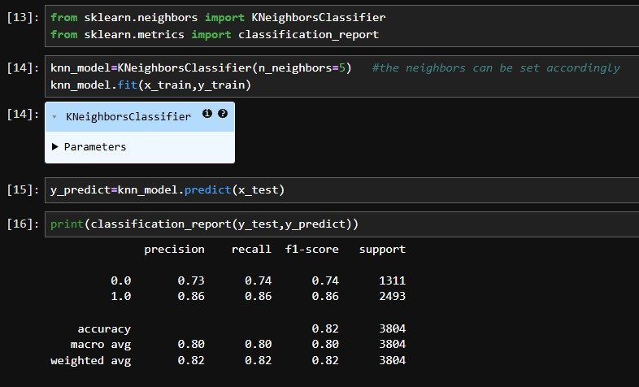
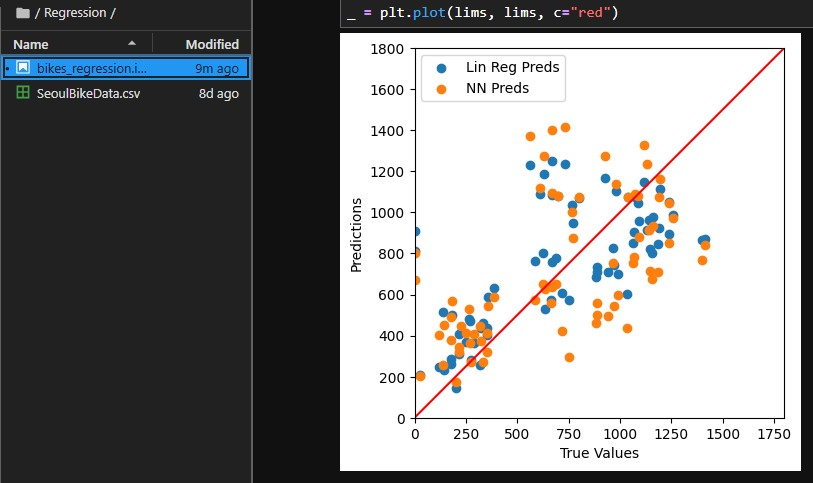
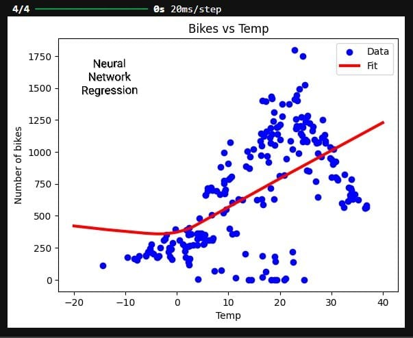
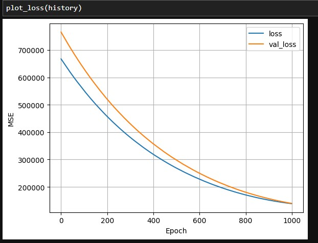

## Projects

Special thanks to, [@kying18](https://github.com/kying18).

## 1. Supervised Learning (Classification) – MAGIC Gamma Telescope

### Description
A binary classification project built using the MAGIC Gamma Telescope dataset. The objective is to classify whether an observed event is a Gamma particle (signal) or a Hadron particle (background) using supervised machine learning techniques.

### Dataset
* **Name:** MAGIC Gamma Telescope Dataset
* **Source:** UCI Machine Learning Repository
* **Link:** https://archive.ics.uci.edu/dataset/159/magic+gamma+telescope

### Models & Results

Five classification models were trained and evaluated on the same train/valid/test split. Accuracy and per-class metrics are summarized below.

| Model | Accuracy | Precision (avg) | Recall (avg) | F1-score (avg) |
|---|---|---|---|---|
| K-Nearest Neighbors (k=5) | 0.82 | 0.82 | 0.80 | 0.80 |
| Logistic Regression | 0.77 | 0.78 | 0.76 | 0.75 |
| Naive Bayes | 0.72 | 0.71 | 0.64 | 0.65 |
| Support Vector Machine (SVM) | 0.86 | 0.86 | 0.84 | 0.84 |
| Neural Network | 0.87 | 0.87 | 0.87 | 0.87 |

The **Neural Network** achieved the best overall performance, closely followed by the **SVM**.

#### K-Nearest Neighbors

#### Logistic Regression

#### Naive Bayes

#### Support Vector Machine (SVM)

#### Neural Network

## 2. Supervised Learning (Regression) – Seoul Bike Sharing Demand

### Description
A regression project built using the Seoul Bike Sharing dataset. The objective is to predict the number of bikes rented at noon based on weather conditions such as temperature, humidity, dew point, solar radiation, rainfall, and snowfall.

### Dataset
- **Name:** Seoul Bike Sharing Demand Dataset
- **Source:** UCI Machine Learning Repository
- **Link:** https://archive.ics.uci.edu/dataset/560/seoul+bike+sharing+demand

### Models & Results
Two regression models were trained and evaluated on the same train/validation/test split (60/20/20). R² and MSE are summarized below.

| Model | Features Used | R² Score | MSE |
|---|---|---|---|
| Linear Regression | Temperature only | 0.26 | — |
| Linear Regression | All 6 weather features | 0.49 | 83,268 |
| Neural Network (Keras, ReLU) | All 6 weather features | — | 113,675 |

### Key Insight
Despite tuning the neural network's hidden layers, learning rate, and epochs, Linear Regression outperformed it on the held-out test set. On a small, low-dimensional dataset, the simpler model generalized better — a reminder that model complexity should be matched to dataset size rather than assumed to improve performance.

### Tech Stack
Python, pandas, NumPy, scikit-learn, TensorFlow/Keras, Matplotlib